# Calories Guard — Database Documentation

> **Source of truth**: Supabase project `zawlghlnzgftlxcoipuf`, PostgreSQL 17.6, schema `cleangoal`.
> **Snapshot taken**: 2026-04-18 (41 tables, 8 enums, 25 non-PK indexes).
> This document is the **pre-v14** input to the normalize/optimize migration — do **not** treat it as a target state.
>
> **Revision 2** (2026-04-18): removed 9 phantom tables I had hallucinated (`articles`, `chatbot_interactions`, `community_posts`, `follows`, `likes`, `recommendations`, `user_detail_logs`, `user_preferences`, `food_reviews`); added 5 real tables that I had missed (`chat_messages`, `recipe_favorites`, `recipe_steps`, `recipe_tips`, `recipe_tools`). No rows or DDL were ever lost — this was a documentation error only.
>
> **Revision 3** (2026-04-19): v14 phases A–F have been applied (`v14_a_critical_fixes`, `v14_b_integrity`, `v14_c_deduplicate`, `v14_d_seed_units`, `v14_e_timestamptz`, `v14_f_drop_unused` in `cleangoal.schema_migrations`). Live schema is now **35 tables** (2 dropped in Phase C: `user_goals`, `user_activities`; 4 in Phase F: `progress`, `weekly_summaries`, `chat_messages`, `user_health_content_views`). All timestamp columns are `timestamptz`. For the post-v14 target state see **[ER_DIAGRAM.md](ER_DIAGRAM.md)**; for the system view see **[SYSTEM_ARCHITECTURE.md](SYSTEM_ARCHITECTURE.md)**. The per-table descriptions below still apply to the surviving tables but the "Issues found" section is now largely resolved — see §7 of ER_DIAGRAM.md for the small remaining list.

---

## Table of contents

1. [Overview](#1-overview)
2. [ER diagram (current state)](#2-er-diagram-current-state)
3. [Domain grouping](#3-domain-grouping)
4. [Per-table descriptions & data dictionary](#4-per-table-descriptions--data-dictionary)
5. [Enums](#5-enums)
6. [Issues found (to be addressed in v14)](#6-issues-found-to-be-addressed-in-v14)

---

## 1. Overview

| Fact | Value |
|---|---|
| DB engine | PostgreSQL 17.6 (Supabase) |
| Schema | `cleangoal` |
| Tables | 41 |
| Enums | 8 (`activity_level`, `content_type`, `food_type`, `gender_type`, `goal_type_enum`, `meal_type`, `notification_type`, `request_status`) |
| Migrations applied | v7 init + v8–v13 + `add_target_macros_to_users` |
| RLS | Enabled on 22 user-owned tables (defense-in-depth; backend uses `postgres` role that bypasses RLS) |
| Row counts (non-zero) | `foods` = 239, `meals` = 10, `detail_items` = 15. All user-owned tables effectively empty → safe window for breaking changes. |

---

## 2. ER diagram (current state)

> Reflects what **actually exists in Supabase today**. FK gaps, nullable critical columns, and orphan `item_id` columns are drawn as they are — not as they should be.

```mermaid
erDiagram
    roles ||--o{ users : has
    users ||--o{ user_goals : sets
    users ||--o{ user_activities : logs
    users ||--o{ user_meal_plans : owns
    users ||--o{ user_favorites : bookmarks
    users ||--o{ user_allergy_preferences : declares
    users ||--o{ temp_food : proposes
    users ||--o{ food_requests : requests
    users ||--o{ meals : "eats (NO FK ⚠)"
    users ||--o{ daily_summaries : accumulates
    users ||--o{ weekly_summaries : aggregates
    users ||--o{ weight_logs : weighs
    users ||--o{ water_logs : hydrates
    users ||--o{ exercise_logs : exercises
    users ||--o{ notifications : receives
    users ||--o{ email_verification_codes : verifies
    users ||--o{ password_reset_codes : resets
    users ||--o{ progress : tracks
    users ||--o{ verified_food : "admin verifies"
    users ||--o{ user_health_content_views : views

    foods ||--o{ beverages : "is-a"
    foods ||--o{ snacks : "is-a"
    foods ||--o{ recipes : "has recipe"
    foods ||--o{ food_ingredients : "composed of"
    foods ||--o{ food_allergy_flags : "flagged as"
    foods ||--o{ user_favorites : favorited

    ingredients ||--o{ food_ingredients : used_in
    units ||--o{ ingredients : default_for
    units ||--o{ food_ingredients : measured_in
    units ||--o{ unit_conversions : from_to

    meals ||--o{ detail_items : contains
    daily_summaries ||--o{ detail_items : rolls_up
    user_meal_plans ||--o{ detail_items : "plans (no FK ⚠)"

    temp_food ||--o{ verified_food : "gets verified"

    allergy_flags ||--o{ food_allergy_flags : tags
    allergy_flags ||--o{ user_allergy_preferences : chosen_by

    health_contents ||--o{ user_health_content_views : viewed_in

    weight_logs ||--o{ progress : linked
    daily_summaries ||--o{ progress : linked

    users {
        bigint user_id PK
        varchar email "NOT NULL, no length cap"
        varchar password_hash "NOT NULL"
        varchar username "nullable"
        gender_type gender
        date birth_date
        numeric height_cm
        numeric current_weight_kg
        goal_type_enum goal_type "duplicated in user_goals"
        activity_level activity_level "duplicated in user_activities"
        numeric target_weight_kg
        int target_calories
        int target_protein
        int target_carbs
        int target_fat
        int role_id FK "default 2"
        bool is_email_verified
        timestamp consent_accepted_at
        int current_streak
        int total_login_days
        timestamp last_login_date
        timestamp deleted_at "soft delete"
    }
    meals {
        bigint meal_id PK
        bigint user_id "nullable, NO FK ⚠"
        bigint item_id "orphan — no FK ⚠"
        timestamp meal_time "default now()"
        numeric total_amount
        timestamp created_at
        timestamp updated_at
    }
    detail_items {
        bigint item_id PK
        bigint meal_id FK "nullable"
        bigint plan_id "no FK ⚠"
        bigint summary_id FK
        bigint food_id "no FK ⚠"
        varchar food_name
        int day_number
        numeric amount
        int unit_id "→ empty units table ⚠"
        numeric cal_per_unit
        numeric protein_per_unit
        numeric carbs_per_unit
        numeric fat_per_unit
        varchar note
        timestamp created_at
    }
    foods {
        bigint food_id PK
        varchar food_name "NOT NULL"
        food_type food_type "default raw_ingredient"
        numeric calories
        numeric protein
        numeric carbs
        numeric fat
        numeric sodium
        numeric sugar
        numeric cholesterol
        numeric serving_quantity "default 100"
        varchar serving_unit "default g"
        varchar image_url
        timestamp deleted_at "soft delete"
    }
    daily_summaries {
        bigint summary_id PK
        bigint user_id FK "nullable ⚠"
        bigint item_id "orphan — no FK ⚠"
        date date_record "nullable ⚠, default CURRENT_DATE"
        numeric total_calories_intake
        numeric total_protein
        numeric total_carbs
        numeric total_fat
        int water_glasses
        int goal_calories
        bool is_goal_met
    }
    temp_food {
        bigint tf_id PK
        bigint user_id FK
        varchar food_name
        numeric protein
        numeric carbs
        numeric fat
        numeric calories
    }
    verified_food {
        bigint vf_id PK
        bigint tf_id FK
        bool is_verify
        bigint verified_by FK
        timestamp verified_at
    }
    water_logs {
        bigint log_id PK
        bigint user_id FK
        date date_record
        int glasses
        timestamp updated_at
    }
    exercise_logs {
        bigint log_id PK
        bigint user_id FK
        date date_record
        varchar activity_name
        int duration_minutes
        numeric calories_burned
        varchar intensity
    }
    weight_logs {
        bigint log_id PK
        bigint user_id FK
        numeric weight_kg
        date recorded_date
    }
```

---

## 3. Domain grouping

The 41 tables cluster into seven domains:

### 3.1 Authentication & users (8)
`roles`, `users`, `user_goals`, `user_activities`, `user_favorites`, `user_allergy_preferences`, `email_verification_codes`, `password_reset_codes`

### 3.2 Food catalog (9)
`foods`, `beverages`, `snacks`, `ingredients`, `food_ingredients`, `units`, `unit_conversions`, `allergy_flags`, `food_allergy_flags`

### 3.3 Meal logging (3)
`meals`, `detail_items`, `user_meal_plans`

### 3.4 Daily/weekly tracking (5)
`daily_summaries`, `weekly_summaries`, `water_logs`, `exercise_logs`, `weight_logs`

### 3.5 Content & recipes (9)
`recipes`, `recipe_ingredients`, `recipe_reviews`, `recipe_steps`, `recipe_tips`, `recipe_tools`, `recipe_favorites`, `health_contents`, `user_health_content_views`

### 3.6 Admin / moderation (3)
`temp_food`, `verified_food`, `food_requests`

### 3.7 Misc (4)
`notifications`, `chat_messages`, `progress`, `schema_migrations`

> Total = 41. `progress` and `user_meal_plans` bridge domains; counted once each.

---

## 4. Per-table descriptions & data dictionary

Only the **core** tables are exhaustively documented below; auxiliary tables receive a one-line description. Columns marked **⚠** are flagged in §6.

### 4.1 `roles`
Lookup table for authorization roles (`admin`, `user`). Referenced by `users.role_id`.

| Column | Type | Nullable | Default | Notes |
|---|---|---|---|---|
| `role_id` | int | NO | seq | PK |
| `role_name` | varchar | NO | – | no UNIQUE constraint ⚠ |

### 4.2 `users`
Account + profile + dashboard state, all merged into one table (25 columns). Duplicates `goal_type` with `user_goals` and `activity_level` with `user_activities`.

| Column | Type | Nullable | Default | Notes |
|---|---|---|---|---|
| `user_id` | bigint | NO | seq | PK |
| `username` | varchar | YES | – | no length cap ⚠ |
| `email` | varchar | NO | – | no length cap, no UNIQUE constraint visible via pg_constraint at time of snapshot ⚠ |
| `password_hash` | varchar | NO | – | bcrypt hash |
| `gender` | `gender_type` | YES | – | enum |
| `birth_date` | date | YES | – | – |
| `height_cm` | numeric | YES | – | no CHECK ⚠ |
| `current_weight_kg` | numeric | YES | – | no CHECK ⚠ |
| `goal_type` | `goal_type_enum` | YES | – | **duplicated in `user_goals.goal_type`** ⚠ |
| `target_weight_kg` | numeric | YES | – | – |
| `target_calories` | int | YES | – | – |
| `target_protein` | int | YES | – | added by migration |
| `target_carbs` | int | YES | – | added by migration |
| `target_fat` | int | YES | – | added by migration |
| `activity_level` | `activity_level` | YES | – | **duplicated in `user_activities.activity_level`** ⚠ |
| `goal_start_date` | date | YES | CURRENT_DATE | – |
| `goal_target_date` | date | YES | – | – |
| `last_kpi_check_date` | date | YES | CURRENT_DATE | – |
| `current_streak` | int | YES | 0 | – |
| `total_login_days` | int | YES | 0 | – |
| `last_login_date` | timestamp | YES | – | no tz ⚠ |
| `avatar_url` | varchar | YES | – | – |
| `role_id` | int | YES | 2 | FK → `roles.role_id` |
| `is_email_verified` | bool | YES | false | – |
| `consent_accepted_at` | timestamp | YES | – | PDPA consent |
| `created_at` | timestamp | YES | now() | no tz ⚠ |
| `updated_at` | timestamp | YES | – | – |
| `deleted_at` | timestamp | YES | – | soft delete |

### 4.3 `foods`
Canonical food catalog (per-100g or per-`serving_unit` nutrition). 239 rows after Thai food seed. Subtype tables `beverages` and `snacks` extend via `food_id`.

| Column | Type | Nullable | Default | Notes |
|---|---|---|---|---|
| `food_id` | bigint | NO | seq | PK |
| `food_name` | varchar | NO | – | no length cap, no UNIQUE ⚠ |
| `food_type` | `food_type` | YES | `raw_ingredient` | enum |
| `calories` | numeric | YES | – | no CHECK ⚠ |
| `protein`,`carbs`,`fat` | numeric | YES | – | no CHECK ⚠ |
| `sodium`,`sugar`,`cholesterol` | numeric | YES | – | – |
| `serving_quantity` | numeric | YES | 100 | – |
| `serving_unit` | varchar | YES | 'g' | free text ⚠ (should FK to `units`) |
| `image_url` | varchar | YES | – | – |
| `created_at`,`updated_at`,`deleted_at` | timestamp | YES | – | soft delete |

### 4.4 `meals` ⚠ **CRITICAL**
Represents one meal slot per user per time (breakfast/lunch/dinner/snack of a day). **The backend INSERTs a `meal_type` column that does NOT exist in this table** — see §6.1.

| Column | Type | Nullable | Default | Notes |
|---|---|---|---|---|
| `meal_id` | bigint | NO | – | PK (sequence not autogenerated — `column_default` is NULL ⚠) |
| `user_id` | bigint | **YES** ⚠ | – | **no FK to users** ⚠ |
| `item_id` | bigint | YES | – | orphan column, no FK ⚠ |
| `meal_time` | timestamp | YES | now() | no tz ⚠ |
| `total_amount` | numeric | YES | – | cached total calories |
| `created_at` | timestamp | YES | now() | – |
| `updated_at` | timestamp | YES | – | – |

**Missing**: `meal_type meal_type` column referenced by `backend/app/routers/meals.py:29`.

### 4.5 `detail_items`
Line items inside a meal (one food + amount). Also used to store meal-plan template items and summary rollups.

| Column | Type | Nullable | Default | Notes |
|---|---|---|---|---|
| `item_id` | bigint | NO | – | PK (default NULL ⚠) |
| `meal_id` | bigint | YES | – | FK → `meals` |
| `plan_id` | bigint | YES | – | **no FK** ⚠ (should reference `user_meal_plans.plan_id`) |
| `summary_id` | bigint | YES | – | FK → `daily_summaries` |
| `food_id` | bigint | YES | – | **no FK** ⚠ (should reference `foods.food_id`) |
| `food_name` | varchar | YES | – | denormalized |
| `day_number` | int | YES | – | for meal-plan templates |
| `amount` | numeric | YES | 1 | – |
| `unit_id` | int | YES | – | FK → `units` (table is empty ⚠) |
| `cal_per_unit` | numeric | YES | – | – |
| `protein_per_unit`,`carbs_per_unit`,`fat_per_unit` | numeric | YES | – | – |
| `note` | varchar | YES | – | – |
| `created_at` | timestamp | YES | now() | – |

### 4.6 `daily_summaries`
One row per user per day — caches totals. Has duplicate UNIQUE constraint (`daily_summaries_user_id_date_record_key` + `uq_daily_summaries_user_date`).

| Column | Type | Nullable | Default | Notes |
|---|---|---|---|---|
| `summary_id` | bigint | NO | seq | PK |
| `user_id` | bigint | **YES** ⚠ | – | FK, but nullable |
| `item_id` | bigint | YES | – | orphan column ⚠ |
| `date_record` | date | **YES** ⚠ | CURRENT_DATE | critical column, nullable |
| `total_calories_intake` | numeric | YES | 0 | – |
| `total_protein`,`total_carbs`,`total_fat` | numeric | YES | 0 | – |
| `water_glasses` | int | YES | 0 | duplicates `water_logs` |
| `goal_calories` | int | YES | – | – |
| `is_goal_met` | bool | YES | false | – |

### 4.7 `temp_food` / `verified_food`
`temp_food` is a staging area where a user's quick-added food lives until an admin approves it. `verified_food` is a 1-row-per-decision audit log. On approval, a row is copied into `foods`.

`temp_food`:

| Column | Type | Nullable | Default | Notes |
|---|---|---|---|---|
| `tf_id` | bigint | NO | seq | PK |
| `food_name` | varchar | NO | – | – |
| `protein`,`carbs`,`fat`,`calories` | numeric | YES | 0 | – |
| `user_id` | bigint | NO | – | FK → `users` |
| `created_at` | timestamp | NO | now() | – |
| `updated_at` | timestamp | YES | – | – |

`verified_food`:

| Column | Type | Nullable | Default | Notes |
|---|---|---|---|---|
| `vf_id` | bigint | NO | seq | PK |
| `tf_id` | bigint | NO | – | FK → `temp_food` |
| `is_verify` | bool | NO | false | true=approved, false=rejected |
| `verified_by` | bigint | YES | – | FK → `users` (admin) |
| `verified_at` | timestamp | YES | – | – |

### 4.8 `water_logs`, `exercise_logs`, `weight_logs`
Straightforward per-user daily trackers. All have `(user_id, date_record)` UNIQUE except `weight_logs` which allows multiple per day.

`water_logs` — user_id, date_record, glasses (int), updated_at. Has **duplicate UNIQUE** (`water_logs_user_date_key` + `uq_water_logs_user_date`) ⚠.
`exercise_logs` — activity_name (varchar 100), duration_minutes, calories_burned, intensity (varchar 20, default 'moderate').
`weight_logs` — weight_kg (no CHECK ⚠), recorded_date.

### 4.9 `notifications`
Per-user notification feed, typed via `notification_type` enum.

| Column | Type | Nullable | Default |
|---|---|---|---|
| `notification_id` | bigint | NO | seq |
| `user_id` | bigint | YES | – |
| `title` | varchar | NO | – |
| `message` | text | YES | – |
| `type` | `notification_type` | YES | – |
| `is_read` | bool | YES | false |
| `created_at` | timestamp | YES | now() |

### 4.10 `user_goals`, `user_activities`
Historical logs of goal/activity changes. Both duplicate columns from `users` — the app currently reads from `users` for the current value, and these tables are essentially unused logs.

### 4.11 `user_meal_plans`
Meal plan templates owned by users. Contains `item_id` orphan column (no FK). `detail_items.plan_id` is the intended link but the FK was never defined.

### 4.12 Food catalog extensions — `beverages`, `snacks`, `recipes`, `recipe_ingredients`, `food_ingredients`, `ingredients`, `units`, `unit_conversions`

- `beverages` and `snacks` are **classic table-per-type inheritance** on `foods.food_id`. `beverages.food_id` and `snacks.food_id` are FKs but **not UNIQUE in some cases** (would allow a food to have two beverage rows) ⚠.
- `recipes` holds cooking instructions and optional link to `foods.food_id`.
- `recipe_ingredients` — free-text `ingredient_name` + `unit` (not FKs). Coexists with `food_ingredients` which uses proper FKs. Two parallel representations of the same concept ⚠.
- `ingredients.default_unit_id` → `units`, but `units` table is **empty (0 rows)** ⚠.
- `unit_conversions` references `units` via `from_unit_id`, `to_unit_id` — also unused.

### 4.13 `allergy_flags`, `food_allergy_flags`, `user_allergy_preferences`
Allergen tagging. `food_allergy_flags` has **duplicate FK definitions** for both `food_id` and `flag_id` ⚠ (2 FKs each in `pg_constraint`).

### 4.14 `email_verification_codes`, `password_reset_codes`
OTP tables. `code` is `VARCHAR(10)`, `expires_at` NOT NULL, `used` default false. These become redundant once auth migrates to Supabase Auth.

### 4.15 `schema_migrations`
Simple `(version varchar(255) PK, applied_at timestamp)`. Currently lists v8–v13 + `add_target_macros_to_users`.

### 4.16 Content tables — `health_contents`, `recipe_reviews`
Editorial content (articles, tips, videos) stored in `health_contents` (typed via `content_type` enum). `recipe_reviews` stores user ratings of recipes; no CHECK on `rating` yet ⚠.

### 4.17 Recipe detail tables — `recipe_steps`, `recipe_tips`, `recipe_tools`, `recipe_favorites`

All four are children of `recipes.recipe_id`.

- **`recipe_steps`** — one step per row: `step_id` PK, `recipe_id`, `step_number` (NOT NULL), `title`, `instruction` (NOT NULL), `time_minutes` (default 0), `image_url`, `tips`, `created_at`. No FK to `recipes` visible in pg_constraint snapshot ⚠.
- **`recipe_tips`** — `tip_id` PK, `recipe_id`, `tip_text` (NOT NULL), `sort_order` (default 0), `created_at`.
- **`recipe_tools`** — `tool_id` PK, `recipe_id`, `tool_name` (NOT NULL), `tool_emoji`, `sort_order` (default 0), `created_at`.
- **`recipe_favorites`** — `fav_id` PK, `recipe_id` + `user_id` (both NOT NULL), `created_at`. Should have UNIQUE `(user_id, recipe_id)` ⚠.

### 4.18 `chat_messages`

Per-user AI coach chat history.

| Column | Type | Nullable | Default | Notes |
|---|---|---|---|---|
| `message_id` | bigint | NO | – | PK (default NULL ⚠) |
| `user_id` | bigint | NO | – | no FK visible ⚠ |
| `role` | varchar(10) | NO | – | 'user' / 'assistant' / 'system' — candidate for enum |
| `content` | text | NO | – | – |
| `created_at` | timestamp | YES | now() | no tz ⚠ |

### 4.19 `progress`

Small aggregate table. Foreign keys present: `user_id → users`, `weight_id → weight_logs`, `daily_id → daily_summaries`. Columns: `current_streak`, `weekly_target` (varchar). Mostly overlaps with `users.current_streak` + `weekly_summaries` — candidate for removal.

### 4.20 `user_favorites`, `user_allergy_preferences`, `user_health_content_views`

- **`user_favorites`** — `id` PK, `user_id` + `food_id` (both NOT NULL, both FK). No UNIQUE → a user could favorite the same food twice ⚠.
- **`user_allergy_preferences`** — composite `(user_id, flag_id)` both NOT NULL and FK, plus `preference_type` (free text), `created_at`.
- **`user_health_content_views`** — `(user_id, content_id)` NOT NULL + FKs, `viewed_at`, `is_bookmarked` (default false). Acts as many-to-many + bookmark flag. No explicit PK visible ⚠.

---

## 5. Enums

| Enum | Values |
|---|---|
| `activity_level` | sedentary, light, moderate, active, very_active |
| `content_type` | article, video, tip, recipe |
| `food_type` | raw_ingredient, prepared_dish, beverage, snack, supplement |
| `gender_type` | male, female, other |
| `goal_type_enum` | lose_weight, maintain_weight, gain_weight, gain_muscle |
| `meal_type` ⚠ | breakfast, lunch, dinner, snack — **defined but never wired to `meals` table** |
| `notification_type` | reminder, achievement, warning, tip, system |
| `request_status` | pending, approved, rejected |

---

## 6. Issues found (to be addressed in v14)

> These are **observations from the live schema**, not prescriptions. The v14 migration will be proposed as a follow-up document for user approval before anything is applied.

### 6.1 🔥 Critical — schema/code divergence

1. **`meals.meal_type` is missing.** `backend/app/routers/meals.py:29` executes `INSERT INTO meals (user_id, meal_type, meal_time, total_amount)` but the live schema has only `(meal_id, user_id, item_id, meal_time, total_amount, created_at, updated_at)`. This INSERT would raise `column "meal_type" does not exist` at runtime. The 10 existing meal rows were likely inserted by older code or seed scripts that omitted that column. `init_database.sql:185` declares the column; it was lost somewhere between v7 and v13.
2. **`meals.user_id` has NO foreign key to `users`** despite carrying user IDs. Deleting a user leaves orphan meals.
3. **`detail_items.food_id` has NO foreign key to `foods`.** Same problem — food deletion won't cascade, and dangling food_ids are possible.
4. **`detail_items.plan_id` has NO foreign key to `user_meal_plans`.**

### 6.2 Nullable critical columns

| Table.column | Reason it shouldn't be nullable |
|---|---|
| `meals.user_id` | Every meal belongs to a user |
| `daily_summaries.user_id` | Every summary belongs to a user |
| `daily_summaries.date_record` | Summary without a date is meaningless |
| `detail_items.meal_id` | Unless detail_items is intentionally polymorphic (meal OR plan OR summary), this should be required; polymorphism is already implemented via `meal_id`, `plan_id`, `summary_id` — needs a CHECK that exactly one is set |

### 6.3 Data duplication (normalization violations)

1. **`users.goal_type` vs `user_goals.goal_type`** — two sources of truth for "current goal".
2. **`users.activity_level` vs `user_activities.activity_level`** — same.
3. **`daily_summaries.water_glasses` vs `water_logs.glasses`** — water tracked in two places.
4. **`recipe_ingredients` (free text) vs `food_ingredients` (FK-based)** — two ways to model ingredients.
5. **Duplicate UNIQUE constraints**: `daily_summaries_user_id_date_record_key` + `uq_daily_summaries_user_date`; `water_logs_user_date_key` + `uq_water_logs_user_date`.
6. **Duplicate FK definitions** in `food_allergy_flags` (two FKs per column in `pg_constraint`).

### 6.4 Orphan / dead columns

| Column | Status |
|---|---|
| `meals.item_id` | No FK, not referenced by any router |
| `daily_summaries.item_id` | No FK, not referenced |
| `user_meal_plans.item_id` | No FK, not referenced |

### 6.5 Empty but FK-referenced

`units` table has 0 rows. Four columns reference it:
- `detail_items.unit_id`
- `food_ingredients.unit_id`
- `ingredients.default_unit_id`
- `unit_conversions.from_unit_id`, `to_unit_id`

Every query joining through `unit_id` will return NULL. Either seed `units` or drop the FK.

### 6.6 Missing constraints

- **No `VARCHAR(n)` length caps** on `users.email`, `users.username`, `foods.food_name`, most text fields.
- **No CHECK constraints** on: `users.height_cm`, `users.current_weight_kg`, `weight_logs.weight_kg`, `foods.calories` / protein / carbs / fat (negative values allowed), `food_reviews.rating` / `recipe_reviews.rating`.
- **No UNIQUE** on `roles.role_name`, `users.email` (needs verification — the constraint query returned no unique rows matching).
- **No UNIQUE** on `beverages.food_id` / `snacks.food_id` — classic table-per-type should be 1:1.

### 6.7 Timezone

All `timestamp` columns are `timestamp without time zone`. For a health app with reminders across time zones, `timestamptz` is the safer default.

### 6.8 Unused / duplicated tables

Candidates for drop — each needs per-table confirmation + `grep` verification against `backend/app/` before the DDL is written:

| Table | Reason |
|---|---|
| `progress` | Overlaps `users.current_streak` + `weekly_summaries` |
| `user_goals` | Superseded by `users.goal_type` + `users.goal_target_date` |
| `user_activities` | Superseded by `users.activity_level` |
| `ingredients`, `food_ingredients` | Parallel model vs `recipe_ingredients` (free text) |
| `units`, `unit_conversions` | Empty (0 rows) — 5 FKs reference them |
| `allergy_flags`, `food_allergy_flags`, `user_allergy_preferences` | Allergy feature — confirm if implemented |
| `recipe_reviews` | Confirm if used |
| `user_health_content_views` | Analytics — keep if tracking views |
| `weekly_summaries` | Possibly derived from `daily_summaries` — confirm usage |

⚠ The earlier revision of this section mentioned phantom tables (`articles`, `chatbot_interactions`, `community_posts`, `follows`, `likes`, `recommendations`, `user_detail_logs`, `user_preferences`, `food_reviews`). **None of those exist** — they were hallucinated; ignore.

---

## Next step

Once this document is reviewed and approved, produce `docs/DB_V14_NORMALIZE_PROPOSAL.md` containing the exact DDL (ADD COLUMN, DROP COLUMN, ADD CONSTRAINT, backfill order) and a rollback plan. No schema changes will be applied until that proposal is accepted.
