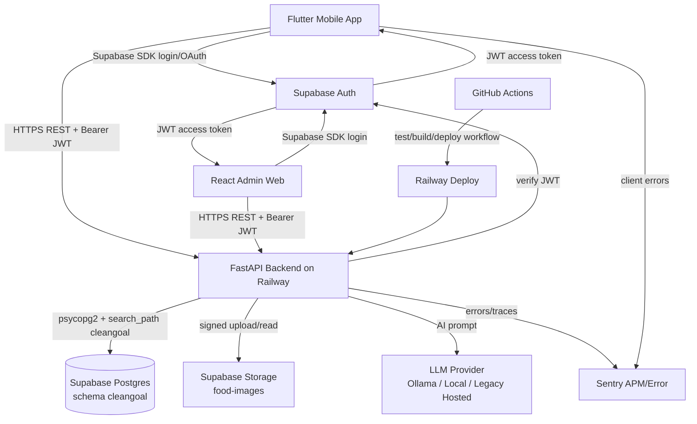
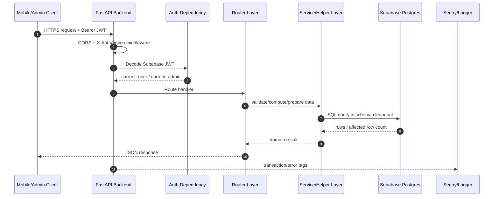
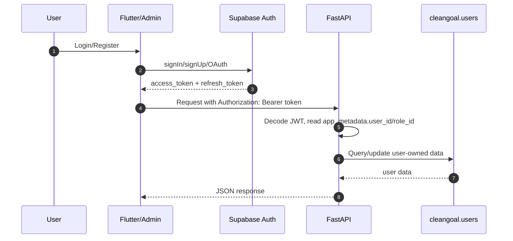
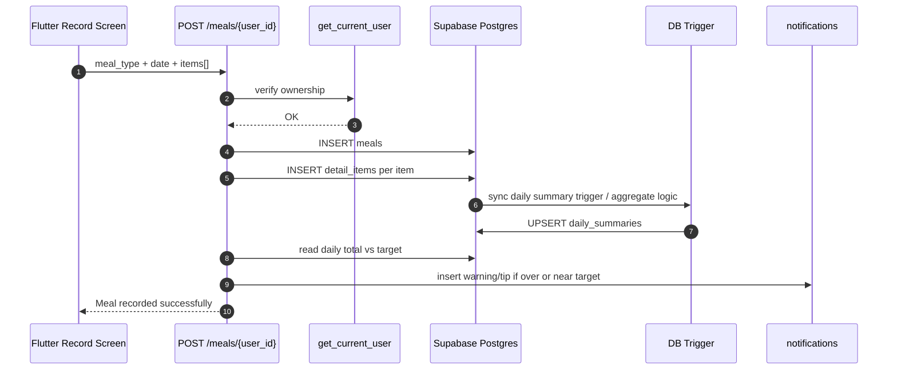
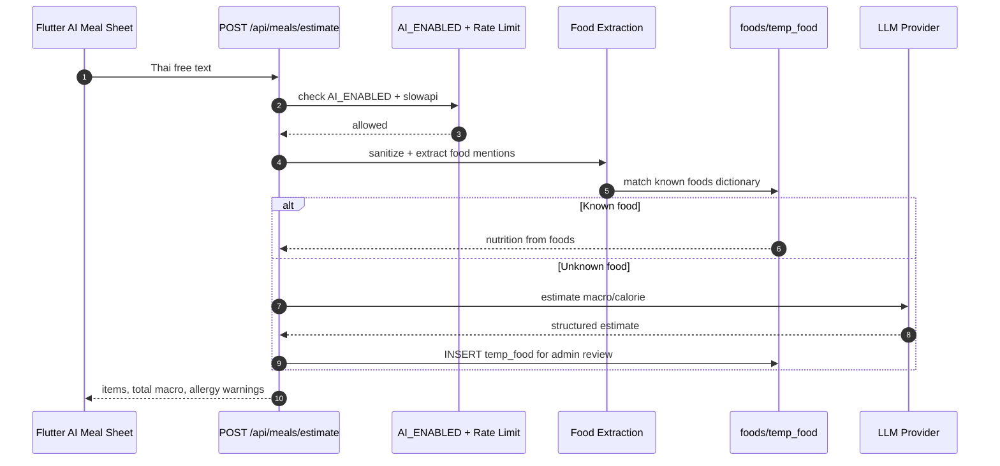
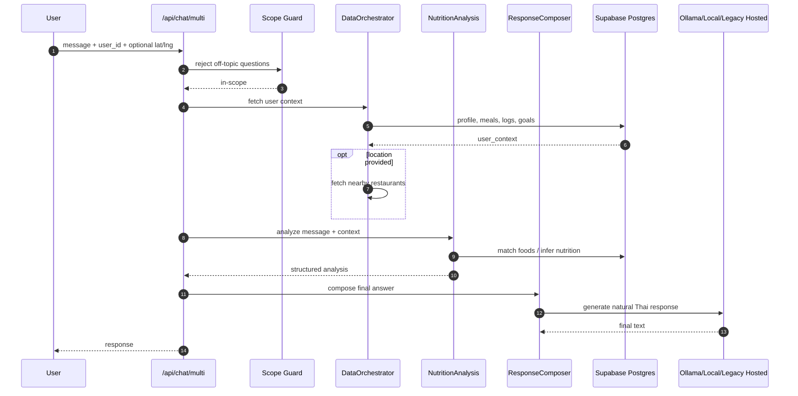
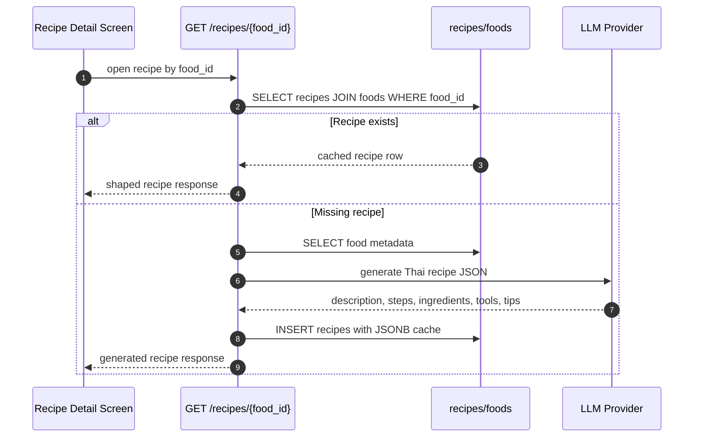
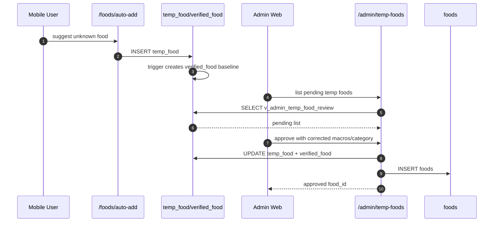
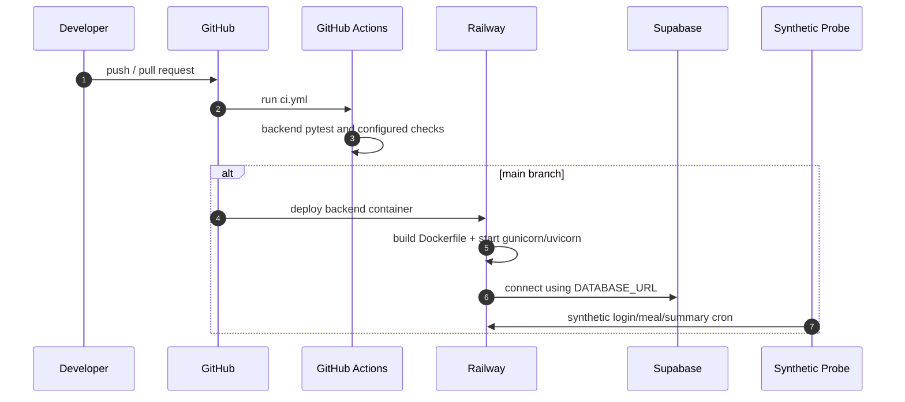

# Orchestration - Calories Guard

วันที่จัดทำ: 2026-04-24
ระบบ: Calories Guard
ขอบเขต: Mobile, Admin Web, Backend, Supabase, AI Provider, Storage, Observability และ CI/CD

เอกสารนี้อธิบายการประสานงานของระบบตั้งแต่ผู้ใช้กดใช้งานในแอป ไปจนถึง backend ตรวจสิทธิ์ เรียก service เขียนฐานข้อมูล เรียก AI provider และส่งผลกลับไปยัง client

## 1. ภาพรวม Orchestration

แนวคิดหลักคือ backend เป็น orchestration hub ของ business logic ส่วน Supabase รับผิดชอบ identity, transactional data และ file storage ส่วน AI provider ถูกซ่อนหลัง `llm_provider.py` เพื่อให้ใช้ Ollama เป็นหลัก และยังสลับไป local transformers หรือ legacy hosted provider ได้โดยไม่ต้องแก้ router หลัก

## 2. Request Orchestration มาตรฐาน

| ขั้น | Component | หน้าที่ |
|---|---|---|
| 1 | Client | ส่ง request ผ่าน HTTPS พร้อม Bearer token |
| 2 | FastAPI | จัดการ CORS, API version header, route matching และ exception handling |
| 3 | Auth dependency | ตรวจ Supabase JWT ด้วย `SUPABASE_JWT_SECRET` |
| 4 | Router | รับ payload, validate schema, คุม transaction และเรียก service |
| 5 | Database | ใช้ `DATABASE_URL`, `psycopg2`, `SET search_path TO cleangoal, public` |
| 6 | Observability | ส่ง trace/error ไป Sentry ใน flow สำคัญ |

## 3. Authentication Orchestration

| ส่วน | รับผิดชอบ |
|---|---|
| Supabase Auth | login, register, OAuth, session และ token lifecycle |
| Flutter/Admin Web | เก็บ session และแนบ token ตอนเรียก backend |
| FastAPI auth dependency | verify token และแยก user/admin |
| `cleangoal.users` | เก็บ profile, role และ health target ของผู้ใช้ |

## 4. Meal Logging Orchestration

| Table | บทบาท |
|---|---|
| `meals` | header ของมื้ออาหารหนึ่งมื้อ |
| `detail_items` | รายการอาหารแต่ละตัวในมื้อ |
| `foods` | catalogue โภชนาการอ้างอิง |
| `units` | หน่วยของ amount ผ่าน `detail_items.unit_id` |
| `daily_summaries` | aggregate ต่อวันสำหรับ progress |
| `notifications` | แจ้งเตือนเมื่อใกล้หรือเกินเป้าหมาย |

## 5. AI Meal Estimate Orchestration

| Mechanism | รายละเอียด |
|---|---|
| `AI_ENABLED` | kill-switch ปิด AI endpoint ผ่าน env |
| Timeout | 30 วินาทีผ่าน thread pool wrapper |
| Rate limit | `/api/meals/estimate` จำกัด 30/hour |
| Temp food review | อาหารที่ AI ประเมินแต่ยังไม่ verified ถูกส่งเข้า `temp_food` |
| Admin approval | admin ตรวจแล้ว promote เข้า `foods` |

## 6. 3-Agent Chat Orchestration

| Agent | หน้าที่ | Output |
|---|---|---|
| DataOrchestratorAgent | ดึงข้อมูลผู้ใช้และบริบทสุขภาพจาก DB | `user_context` |
| NutritionAnalysisAgent | วิเคราะห์อาหาร กิจกรรม goal และ allergy | `analysis` |
| ResponseComposerAgent | เรียบเรียงคำตอบภาษาไทยให้อ่านง่าย | `final_response` |

## 7. Recipe Lazy-Fill Orchestration

| Table | บทบาท |
|---|---|
| `foods` | อาหารที่ผู้ใช้กดดูสูตร |
| `recipes` | recipe header และ JSONB AI cache |
| `recipe_reviews` | รีวิวต่อ `recipe_id` |
| `recipe_ingredients/steps/tools/tips` | recipe detail แบบ normalized สำหรับข้อมูล seed/edit |

## 8. Admin Food Approval Orchestration

## 9. Deployment Orchestration

| Workflow | หน้าที่ |
|---|---|
| `.github/workflows/ci.yml` | ตรวจคุณภาพ code/test ตอน push/PR |
| `.github/workflows/deploy.yml` | deploy staging/prod ตาม branch/manual dispatch |
| `.github/workflows/synthetic.yml` | probe E2E ทุก 10 นาทีตาม configuration |

## 10. Failure Handling

| Failure | Detection | Handling |
|---|---|---|
| JWT หมดอายุหรือไม่ถูกต้อง | auth dependency | return 401, client logout/refresh |
| user เข้าถึงข้อมูลคนอื่น | `check_ownership` | return 403 |
| AI provider ช้า | timeout 30s | return 504 |
| AI ถูกปิด | `AI_ENABLED=false` | return 503 |
| DB constraint fail | PostgreSQL FK/unique/check | transaction rollback |
| orphan legacy data | v17/v18 migration checks | archive table ก่อน enforce FK |
| deploy fail | Railway/GitHub Actions | healthcheck/synthetic fail |

## 11. Summary

Calories Guard ใช้ backend เป็น orchestration hub:

1. Client authenticate กับ Supabase Auth
2. Client ส่ง token ให้ FastAPI
3. FastAPI ตรวจสิทธิ์และ ownership
4. Router เรียก service, DB, AI หรือ storage ตามงาน
5. Supabase Postgres enforce relationship, RLS และ trigger
6. Sentry, GitHub Actions และ synthetic probe ตรวจ runtime/deployment

