# Supabase `cleangoal` 3NF Audit

Date: 2026-04-24  
Project ref: `zawlghlnzgftlxcoipuf`  
Schema: `cleangoal`  
Verification source: live Supabase Postgres through the Supabase session pooler.

Companion column snapshot: [SUPABASE_DATA_DICTIONARY_LIVE_2026_04_24.md](SUPABASE_DATA_DICTIONARY_LIVE_2026_04_24.md)

## Executive Summary

Live Supabase is now in a much better shape for ER diagram and data dictionary work.

Applied migration:

- `v16_a_recipes_ai_fields` — add JSONB recipe AI cache fields.
- `v17_recipe_consistency` — normalize recipe reviews to `recipe_id`.
- `v18_dishes_3nf_integrity` — add dish/category taxonomy, map foods to units, archive invalid legacy rows, and enforce missing FKs.
- `v19_detail_items_unit_fk` — add the remaining FK from meal detail rows to `units`.

Current result after `v18`:

- 40 base tables in `cleangoal`.
- 103 active `foods` rows.
- 103 `dishes` rows.
- 6 `dish_categories` rows.
- `foods.dish_id` mapped for all active foods.
- `foods.serving_unit_id` mapped for all foods that have `serving_unit`.
- Main orphan checks are all `0`.
- Non-PK, non-archive `_id` columns without FK: `0`.
- RLS enabled tables: 40 / 40.
- Duplicate uniqueness constraints from old migrations were removed.
- RLS is enabled on new `dish_categories`, `dishes`, and archive tables.

Important honesty note: the relational core is now normalized enough for a clean ERD and data dictionary. A mathematically strict "100% pure 3NF" database would also remove intentional app caches such as `daily_summaries` and semi-structured recipe JSONB fields. For this app those are acceptable controlled denormalizations, because they serve performance and LLM-cache behavior and are documented below.

## What `v18_dishes_3nf_integrity` Added

Migration file:

```text
backend/migrations/v18_dishes_3nf_integrity.sql
```

Changes:

- Created `dish_categories`.
- Created `dishes`.
- Added `foods.dish_id -> dishes(dish_id)`.
- Added `foods.serving_unit_id -> units(unit_id)`.
- Added missing unit `set`.
- Added `recipes.favorite_count`, because existing trigger `update_recipe_favorite_count()` and Flutter recipe UI expect it.
- Archived orphan rows from old recipe child tables into `recipe_relation_orphan_archive`.
- Archived invalid old unit conversions into `unit_conversion_orphan_archive`.
- Added missing FKs for recipe child tables and `unit_conversions`.
- Added `detail_items.unit_id -> units(unit_id)` in the repo version for fresh rebuilds.
- Removed duplicate unique constraints/indexes that represented the same business rules twice.

Follow-up migration `v19_detail_items_unit_fk` was applied to the already-migrated live database because `v18` had already been recorded in `schema_migrations` before the final `_id` scan caught `detail_items.unit_id`.

Archive counts after migration:

| Archive table | Rows | Meaning |
|---|---:|---|
| `recipe_reviews_orphan_archive` | 20 | Old review seed rows that could not map to live `recipes/users` during v17 |
| `recipe_relation_orphan_archive` | 100 | Old recipe ingredient/step/tip/tool/favorite rows whose `recipe_id` or `user_id` did not exist |
| `unit_conversion_orphan_archive` | 19 | Old conversion rows pointing to deleted/reseeded unit IDs |

These rows were not silently lost. They were archived as JSONB with source table and legacy IDs.

## Live Verification Results

### Applied Migrations

| Migration | Status |
|---|---|
| `v16_a_recipes_ai_fields` | Applied |
| `v17_recipe_consistency` | Applied |
| `v18_dishes_3nf_integrity` | Applied |
| `v19_detail_items_unit_fk` | Applied |

### Relationship Integrity Checks

All of these checks returned `0` missing references after `v18`:

| Check | Missing rows |
|---|---:|
| `daily_summaries -> users` | 0 |
| `detail_items -> foods` | 0 |
| `detail_items -> units` | 0 |
| `foods -> dishes` | 0 |
| `foods -> units` via `serving_unit_id` | 0 |
| `meals -> users` | 0 |
| `recipe_favorites -> recipes` | 0 |
| `recipe_favorites -> users` | 0 |
| `recipe_ingredients -> recipes` | 0 |
| `recipe_reviews -> recipes` | 0 |
| `recipe_reviews -> users` | 0 |
| `recipe_steps -> recipes` | 0 |
| `recipe_tips -> recipes` | 0 |
| `recipe_tools -> recipes` | 0 |
| `unit_conversions.from_unit_id -> units` | 0 |
| `unit_conversions.to_unit_id -> units` | 0 |

### Food Taxonomy Mapping

| Metric | Value |
|---|---:|
| Active foods | 103 |
| Active foods without `dish_id` | 0 |
| Foods with `serving_unit` but missing `serving_unit_id` | 0 |
| Distinct dish rows linked from foods | 103 |

Dish categories created from live `foods.food_category` and `foods.food_type`:

| Category | Food type | Dish count |
|---|---|---:|
| `อาหารไทย` | `dish` | 36 |
| `เส้น/ก๋วยเตี๋ยว` | `dish` | 4 |
| `อาหารตะวันตก` | `dish` | 3 |
| `ผัก/วัตถุดิบ` | `raw_ingredient` | 30 |
| `ผลไม้/ของว่าง` | `snack` | 20 |
| `เครื่องดื่ม` | `beverage` | 10 |

## ERD Starting Point

Use this as the current ERD base. It shows the active normalized structure after `v18`.

```mermaid
erDiagram
    roles ||--o{ users : assigns
    users ||--o{ meals : owns
    users ||--o{ daily_summaries : summarizes
    users ||--o{ weight_logs : tracks
    users ||--o{ water_logs : tracks
    users ||--o{ exercise_logs : tracks
    users ||--o{ notifications : receives
    users ||--o{ user_favorites : bookmarks_food
    users ||--o{ user_allergy_preferences : declares
    users ||--o{ user_meal_plans : plans
    users ||--o{ temp_food : submits
    users ||--o{ food_requests : requests
    users ||--o{ verified_food : reviews_as_admin
    users ||--o{ recipe_reviews : writes
    users ||--o{ recipe_favorites : bookmarks_recipe

    dish_categories ||--o{ dishes : groups
    dishes ||--o{ foods : classifies
    units ||--o{ foods : serving_unit
    units ||--o{ ingredients : default_unit
    units ||--o{ food_ingredients : measured_in
    units ||--o{ unit_conversions : from_unit
    units ||--o{ unit_conversions : to_unit

    foods ||--o{ detail_items : logged_as
    foods ||--o{ recipes : has_recipe
    foods ||--o{ user_favorites : favorited
    foods ||--o{ food_allergy_flags : has_flag
    foods ||--o{ beverages : beverage_subtype
    foods ||--o{ snacks : snack_subtype
    foods ||--o{ food_ingredients : composed_of

    allergy_flags ||--o{ food_allergy_flags : labels
    allergy_flags ||--o{ user_allergy_preferences : user_avoids
    ingredients ||--o{ food_ingredients : used_in

    meals ||--o{ detail_items : contains
    daily_summaries ||--o{ detail_items : rolls_up
    user_meal_plans ||--o{ detail_items : planned_items

    recipes ||--o{ recipe_ingredients : has
    recipes ||--o{ recipe_steps : has
    recipes ||--o{ recipe_tools : has
    recipes ||--o{ recipe_tips : has
    recipes ||--o{ recipe_reviews : receives
    recipes ||--o{ recipe_favorites : favorited

    temp_food ||--o| verified_food : approved_as
```



## Table Inventory And 3NF Status

| Table | Rows | Main key / relationship role | 3NF status |
|---|---:|---|---|
| `roles` | 2 | Role lookup for `users.role_id` | 3NF |
| `users` | 19 | Account/profile root; parent of most user-owned data | 3NF, with derived health targets kept on user profile |
| `email_verification_codes` | 0 | Verification code per user/email flow | 3NF |
| `password_reset_codes` | 0 | Password reset code per user/email flow | 3NF |
| `notifications` | 14 | User notification rows | 3NF |
| `health_contents` | 20 | Public health article/video content | 3NF |
| `dish_categories` | 6 | Food taxonomy category lookup | 3NF |
| `dishes` | 103 | Normalized dish/menu concept under category | 3NF |
| `foods` | 103 | Nutritional item; now links to `dishes` and `units` | 3NF-compatible; legacy text category/unit columns retained for app compatibility |
| `units` | 16 | Unit lookup | 3NF |
| `unit_conversions` | 5 | Conversion relation between two `units` rows | 3NF after v18 FKs |
| `allergy_flags` | 20 | Allergy lookup | 3NF |
| `food_allergy_flags` | 0 | Many-to-many food/allergy bridge | 3NF |
| `user_allergy_preferences` | 1 | Many-to-many user/allergy preference bridge | 3NF |
| `ingredients` | 0 | Ingredient lookup | 3NF |
| `food_ingredients` | 0 | Food/ingredient bridge | 3NF |
| `beverages` | 0 | Optional subtype details for beverage foods | 3NF but currently unused |
| `snacks` | 0 | Optional subtype details for snack foods | 3NF but currently unused |
| `meals` | 23 | User meal header | 3NF |
| `detail_items` | 26 | Meal/daily summary/planned item detail | 3NF with exclusivity check for parent type and unit FK |
| `daily_summaries` | 12 | Daily aggregate cache per user/date | Intentional denormalization |
| `water_logs` | 8 | User water log, syncs into `daily_summaries` | 3NF source event table |
| `exercise_logs` | 0 | User exercise log | 3NF |
| `weight_logs` | 14 | User weight log | 3NF |
| `user_meal_plans` | 0 | Planned meals per user | 3NF |
| `user_favorites` | 0 | User favorite food bridge | 3NF |
| `recipes` | 5 | Recipe per food; includes AI JSONB cache | Mostly 3NF; JSONB recipe payload is intentional cache |
| `recipe_ingredients` | 35 | Normalized recipe ingredient rows | 3NF after v18 FKs |
| `recipe_steps` | 20 | Normalized recipe step rows | 3NF after v18 FKs |
| `recipe_tools` | 12 | Normalized recipe tool rows | 3NF after v18 FKs |
| `recipe_tips` | 10 | Normalized recipe tip rows | 3NF after v18 FKs |
| `recipe_reviews` | 1 | User review per recipe | 3NF after v17 |
| `recipe_favorites` | 0 | User favorite recipe bridge | 3NF after v18, but product path currently prefers `user_favorites(food_id)` |
| `temp_food` | 5 | User-submitted unverified food | 3NF |
| `verified_food` | 5 | Admin-verified temp food record | 3NF |
| `food_requests` | 0 | Legacy/manual request workflow | 3NF but overlaps `temp_food`/`verified_food` conceptually |
| `schema_migrations` | 22 | Migration ledger | 3NF |
| `recipe_reviews_orphan_archive` | 20 | Archive of invalid v17 review rows | Audit/archive table |
| `recipe_relation_orphan_archive` | 100 | Archive of invalid v18 recipe relation rows | Audit/archive table |
| `unit_conversion_orphan_archive` | 19 | Archive of invalid v18 unit conversion rows | Audit/archive table |

## 1NF / 2NF / 3NF Review

### First Normal Form

Good:

- Each core table has a primary key.
- Repeating many-to-many values are modeled through bridge tables:
  - `food_allergy_flags`
  - `user_allergy_preferences`
  - `food_ingredients`
  - `recipe_favorites`
  - `user_favorites`
- Recipe child lists can be represented with row tables:
  - `recipe_ingredients`
  - `recipe_steps`
  - `recipe_tools`
  - `recipe_tips`

Intentional exceptions:

- `recipes.ingredients_json`, `tools_json`, and `tips_json` store LLM output. This is a cache for generated content, not the relational source of truth for editable ingredient inventory.
- Some API responses still read legacy text columns such as `foods.food_category` and `foods.serving_unit`. They remain during app transition, but `dish_id` and `serving_unit_id` are now the normalized references.

### Second Normal Form

Good:

- Most tables use single-column surrogate PKs, so partial dependency risk is low.
- Bridge tables enforce unique pair constraints for business relationships.
- `unit_conversions` now depends on `(from_unit_id, to_unit_id)` as a relationship between lookup rows.

Watch:

- If a future bridge table uses a composite PK, every non-key attribute must depend on the whole composite key. Current schema is safe because bridge tables either have surrogate IDs or only relationship-specific attributes.

### Third Normal Form

Good after `v18`:

- Food category names are no longer only repeated text on `foods`; they are normalized into `dish_categories`.
- Menu/dish identity is normalized into `dishes`.
- Serving units now have `foods.serving_unit_id`.
- Recipe child tables and unit conversions now have enforced parent FKs.
- `detail_items.unit_id` now has an enforced parent FK.
- Old duplicate unique constraints were removed.

Intentional controlled denormalizations:

- `daily_summaries` stores totals derived from meal/detail/water/exercise rows. Keep it because the progress screen needs fast daily reads.
- `recipes.avg_rating`, `review_count`, and `favorite_count` are aggregate counters maintained by triggers. Keep them because recipe detail screens need fast social stats.
- `recipes.*_json` fields are LLM cache payloads. Keep them unless the product decides to build full admin editing for recipe parts.

## Recommended ERD Grouping

For the final ER diagram, group tables into these bounded contexts:

| Group | Tables |
|---|---|
| Identity/Auth | `roles`, `users`, `email_verification_codes`, `password_reset_codes` |
| Food taxonomy | `dish_categories`, `dishes`, `foods`, `units`, `unit_conversions` |
| Allergy/ingredients | `allergy_flags`, `food_allergy_flags`, `user_allergy_preferences`, `ingredients`, `food_ingredients` |
| Meal tracking | `meals`, `detail_items`, `daily_summaries`, `water_logs`, `exercise_logs`, `weight_logs`, `user_meal_plans` |
| Recipe/social | `recipes`, `recipe_ingredients`, `recipe_steps`, `recipe_tools`, `recipe_tips`, `recipe_reviews`, `recipe_favorites`, `user_favorites` |
| Moderation | `temp_food`, `verified_food`, `food_requests` |
| Content/notification | `health_contents`, `notifications` |
| Ops/audit | `schema_migrations`, `recipe_reviews_orphan_archive`, `recipe_relation_orphan_archive`, `unit_conversion_orphan_archive` |

## Data Dictionary Notes

Use these naming decisions in the final data dictionary:

- `dish_categories`: category of a dish/menu, derived from former `foods.food_category`.
- `dishes`: canonical menu/dish identity. One dish can have one or more food/nutrition variants later. Today it is one-to-one with current `foods`.
- `foods`: nutrition facts row used by search, meal logging, and recommendations.
- `units`: normalized units. `foods.serving_unit` is legacy display text; `foods.serving_unit_id` is the normalized FK.
- `recipes`: recipe header/cache row for a food. One `food` has zero or one `recipe`.
- `recipe_*` child tables: normalized recipe detail rows for editable/seeded recipe data.
- `daily_summaries`: aggregate read model, not source event data.
- `*_orphan_archive`: migration audit data; keep hidden from app users.

## Remaining Cleanup Before Final Production

These are not blockers for ERD/data dictionary, but should be tracked:

1. Decide whether the app should eventually read `foods.dish_id` and `foods.serving_unit_id` directly, then retire legacy text columns in a later breaking migration.
2. Decide whether `recipe_favorites` should be used by the mobile recipe screen or retired in favor of `user_favorites(food_id)`.
3. Decide whether `food_requests` should be merged into `temp_food`/`verified_food`.
4. Decide whether empty subtype tables `beverages` and `snacks` are worth keeping.
5. Decide whether empty `ingredients`/`food_ingredients` should become the future nutrition ingredient model or be removed.
6. Rotate the Supabase DB password before staging/production work because it was pasted into chat.

## Verification Queries

Useful checks to rerun after future migrations:

```sql
SELECT version
FROM cleangoal.schema_migrations
WHERE version IN (
  'v16_a_recipes_ai_fields',
  'v17_recipe_consistency',
  'v18_dishes_3nf_integrity',
  'v19_detail_items_unit_fk'
)
ORDER BY version;

SELECT
  count(*) FILTER (WHERE deleted_at IS NULL) AS active_foods,
  count(*) FILTER (WHERE deleted_at IS NULL AND dish_id IS NULL) AS active_foods_without_dish,
  count(*) FILTER (WHERE serving_unit IS NOT NULL AND serving_unit_id IS NULL) AS foods_without_serving_unit_id
FROM cleangoal.foods;

SELECT 'recipe_ingredients_missing_recipe' AS check_name, count(*)
FROM cleangoal.recipe_ingredients x
LEFT JOIN cleangoal.recipes r ON r.recipe_id = x.recipe_id
WHERE r.recipe_id IS NULL
UNION ALL
SELECT 'detail_items_missing_unit', count(*)
FROM cleangoal.detail_items x
LEFT JOIN cleangoal.units u ON u.unit_id = x.unit_id
WHERE x.unit_id IS NOT NULL AND u.unit_id IS NULL
UNION ALL
SELECT 'recipe_steps_missing_recipe', count(*)
FROM cleangoal.recipe_steps x
LEFT JOIN cleangoal.recipes r ON r.recipe_id = x.recipe_id
WHERE r.recipe_id IS NULL
UNION ALL
SELECT 'recipe_tips_missing_recipe', count(*)
FROM cleangoal.recipe_tips x
LEFT JOIN cleangoal.recipes r ON r.recipe_id = x.recipe_id
WHERE r.recipe_id IS NULL
UNION ALL
SELECT 'recipe_tools_missing_recipe', count(*)
FROM cleangoal.recipe_tools x
LEFT JOIN cleangoal.recipes r ON r.recipe_id = x.recipe_id
WHERE r.recipe_id IS NULL
UNION ALL
SELECT 'unit_conversions_missing_from_unit', count(*)
FROM cleangoal.unit_conversions x
LEFT JOIN cleangoal.units u ON u.unit_id = x.from_unit_id
WHERE u.unit_id IS NULL
UNION ALL
SELECT 'unit_conversions_missing_to_unit', count(*)
FROM cleangoal.unit_conversions x
LEFT JOIN cleangoal.units u ON u.unit_id = x.to_unit_id
WHERE u.unit_id IS NULL;
```
