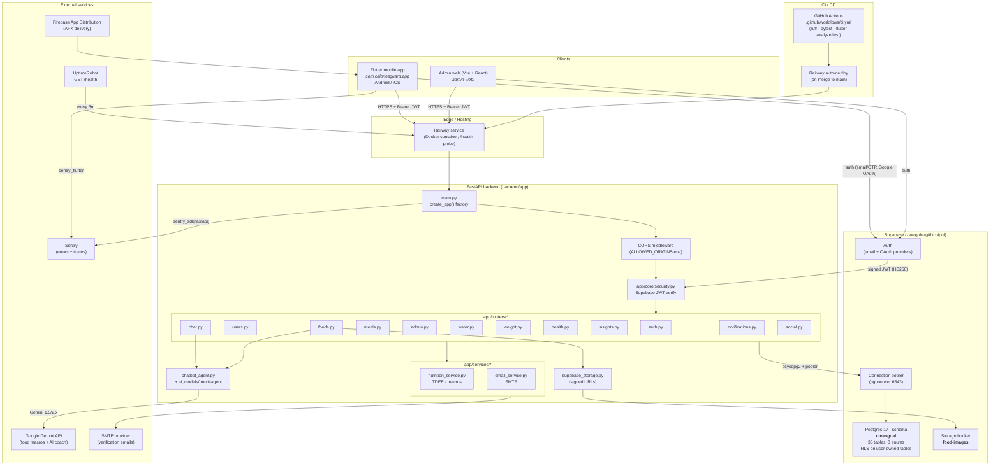
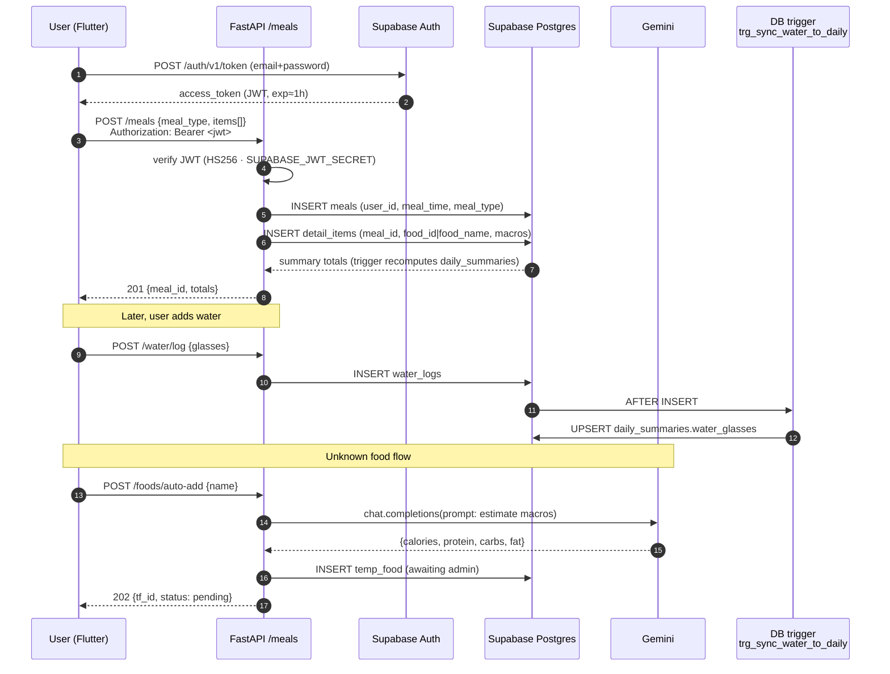
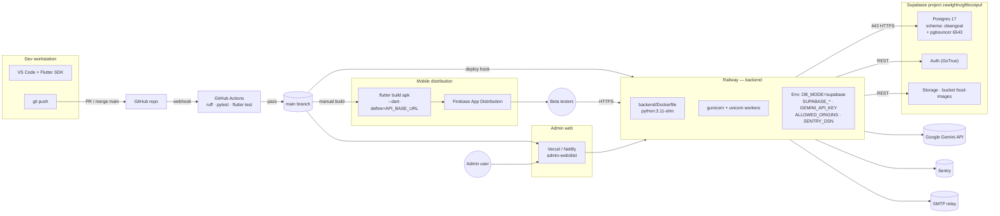

# System Architecture — Calories Guard

_Snapshot: 2026-04-19, branch `claude/jolly-wu` (post-v14)._
_Target deployment: Railway (backend container) + Supabase (Postgres/Auth/Storage) + Firebase App Distribution (APK)._

---

## 1. High-level Component Diagram

_Rationale for the layout: clients at the top, edge/ingress next, backend responsibilities expanded in the centre, persistence + side-effects on the right, dev pipeline at the bottom. This matches the layering that the codebase actually enforces (routers → services → DB / external API)._

---

## 2. Request lifecycle — a typical meal log

---

## 3. Infrastructure view (deployment)

---

## 4. Flutter app — layered structure

```mermaid
flowchart TB
    subgraph UI["UI layer (lib/screens/*)"]
      direction TB
      LoginS["auth/login_screen"]
      RecordS["record/record_food_screen"]
      ProgressS["profile/.../progress_screen"]
      AdminS["admin/*"]
    end

    subgraph State["State/helpers"]
      AuthCtx["providers/auth_provider"]
      NotifHelp["services/notification_helper"]
      LifeCycle["services/lifecycle_service"]
    end

    subgraph Net["Network / data"]
      APIClient["services/api_client.dart<br/>dio + interceptors<br/>(Authorization · timeout · 401→logout)"]
      AuthSvc["services/auth_service.dart<br/>Supabase Flutter SDK"]
      HealthSvc["services/health_service.dart"]
    end

    subgraph Platform["Platform"]
      SecureStore["flutter_secure_storage<br/>(refresh token)"]
      Firebase["firebase_core<br/>(App Distribution only)"]
      SentryFl["sentry_flutter"]
    end

    UI --> State --> Net
    Net --> APIClient --> Backend[(FastAPI /api)]
    Net --> AuthSvc --> Supabase[(Supabase Auth)]
    AuthSvc --> SecureStore
    UI --> Platform
    Platform --> SentryFl
```

---

## 5. Environments / config matrix

| Concern | Local dev | Staging (Railway) | Production (Railway) |
|---|---|---|---|
| `DB_MODE` | `local` (psycopg → localhost) | `supabase` | `supabase` |
| `SUPABASE_URL` | dev branch URL | staging Supabase project | prod Supabase project |
| `ALLOWED_ORIGINS` | `http://localhost:5173` | staging admin domain | prod admin domain |
| `GEMINI_API_KEY` | dev key (rate-limited) | staging key | prod key |
| `SENTRY_DSN` | empty (sentry disabled) | staging DSN | prod DSN |
| `APP_ENV` | `dev` | `staging` | `production` |
| `--dart-define=API_BASE_URL` | `http://10.0.2.2:8000` (emulator) | staging Railway URL | prod Railway URL |

---

## 6. Security posture (current)

- **Transport**: Railway fronts TLS 1.2+; backend sees `X-Forwarded-Proto: https`.
- **AuthN**: Supabase issues JWT (HS256 · `SUPABASE_JWT_SECRET`). Backend verifies signature + `exp`, maps `sub` → `cleangoal.users.user_id`.
- **AuthZ**: Route-level dependency `get_current_user()` / `get_current_admin()` (role_id == 1). RLS on user-owned tables acts as a second line — anon/authenticated keys cannot read those tables directly.
- **Rate limiting**: `slowapi` — `/login` 5/15min/IP, `/chat/*` 10/hour/user, `/upload-image` 10/min/user.
- **Upload validation**: 5 MB cap, mime whitelist (`image/jpeg|png|webp`).
- **Secrets**: Never in repo — Railway env vars + `flutter_secure_storage` on device. `.env.example` only documents keys.
- **Monitoring**: Sentry captures exceptions in both backend and Flutter client; UptimeRobot pings `/health`.

---

## 7. Data flow summary

| Source | Sink | Transport | Notes |
|---|---|---|---|
| Flutter app | FastAPI | HTTPS REST + Bearer JWT | Central `api_client.dart` handles 401→logout |
| FastAPI | Supabase Postgres | psycopg2 over pgbouncer (6543) | Pooled, SSL required |
| FastAPI | Gemini | HTTPS REST | 30s timeout + 1 retry |
| FastAPI | Supabase Storage | REST (service role) | Signed URLs returned to client |
| Flutter | Supabase Auth | HTTPS (GoTrue) | Email/OTP, Google OAuth |
| Backend / Flutter | Sentry | HTTPS | Errors + 10% traces |
| UptimeRobot | Railway | HTTPS `GET /health` | 5-minute interval |

---

## 8. Related docs

- `docs/ER_DIAGRAM.md` — full 35-table schema
- `docs/DATA_DICTIONARY.md` — table-by-table column descriptions
- `docs/DB_V14_NORMALIZE_PROPOSAL.md` — v14 rationale + rollback
- `docs/DEPLOYMENT.md` — step-by-step Railway + Supabase setup
- `docs/DEVELOPMENT.md` — local dev onboarding
