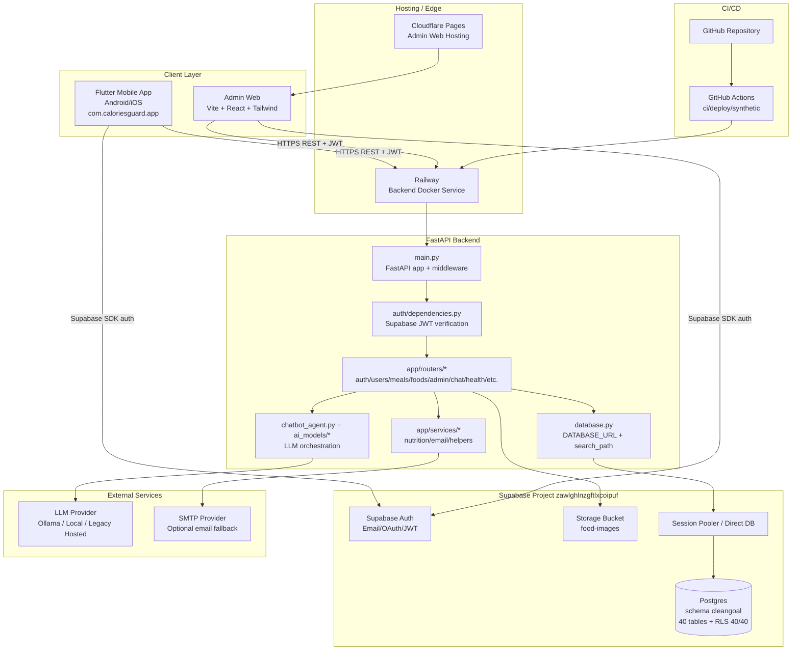
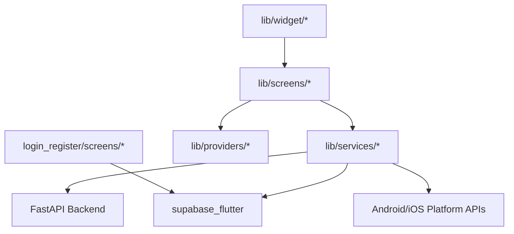
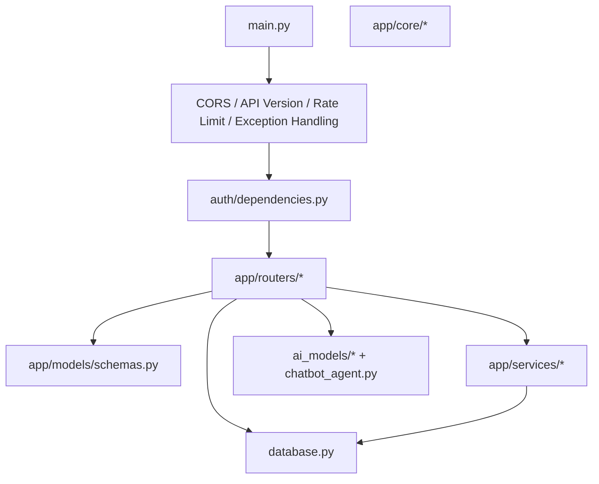
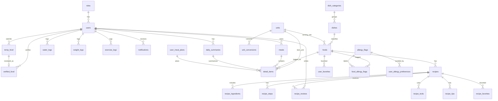
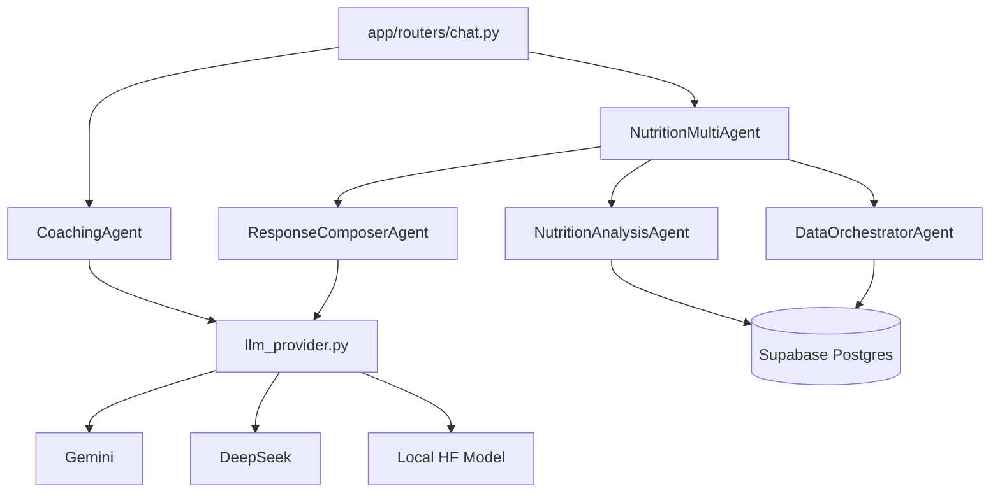
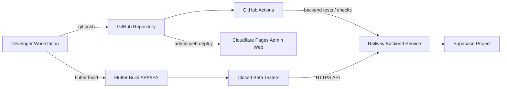

# System Architecture - Calories Guard

วันที่จัดทำ: 2026-04-24
สถานะ schema: Supabase `cleangoal` post-v19
สถานะระบบ: Flutter Mobile + React Admin Web + FastAPI Backend + Supabase + LLM Provider

เอกสารนี้อธิบายสถาปัตยกรรมระบบ Calories Guard แบบ end-to-end สำหรับใช้ประกอบรายงาน, ER Diagram, Data Dictionary และ deployment handoff

## 1. Architecture Overview

Calories Guard เป็นระบบติดตามแคลอรี่และสุขภาพ แบ่งเป็น 5 ชั้นหลัก

| Layer | Technology | หน้าที่หลัก |
|---|---|---|
| Client Mobile | Flutter (`flutter_application_1/`) | ผู้ใช้ login, บันทึกอาหาร/น้ำ/น้ำหนัก, ดู progress, recipe และ AI coach |
| Admin Web | React + Vite + Tailwind (`admin-web/`) | Admin ตรวจอาหารใหม่ จัดการ foods, users และ requests |
| Backend API | FastAPI + Gunicorn/Uvicorn (`backend/`) | Business logic, auth guard, DB orchestration และ AI orchestration |
| Data Platform | Supabase Auth/Postgres/Storage | Authentication, PostgreSQL schema `cleangoal`, bucket `food-images` |
| AI/Observability/Ops | Ollama DeepSeek/local/legacy hosted, Sentry, GitHub Actions, Railway | AI analysis, monitoring และ deploy automation |

ระบบออกแบบให้ backend เป็นศูนย์กลางของ business orchestration ส่วน Supabase ทำหน้าที่ identity, data และ storage โดย client ไม่เขียนข้อมูล user-owned tables โดยตรงผ่าน PostgREST

## 2. High-Level Component Diagram

## 3. Client Architecture

### 3.1 Flutter Mobile App

ตำแหน่ง code: `flutter_application_1/`

| Module | หน้าที่ |
|---|---|
| `main.dart` | bootstrap app และ initialize providers/services |
| `login_register/screens/*` | onboarding, register, login และ health profile setup |
| `screens/record/*` | บันทึกอาหารและ meal detail |
| `screens/recommend_food/*` | recommended food และ recipe detail |
| `screens/profile/*` | profile, progress และ settings |
| `services/api_client.dart` | เรียก backend REST API และจัดการ headers/token |
| `services/auth_service.dart` | เชื่อม Supabase Auth |
| `services/error_reporter.dart` | centralized error reporting |
| `services/health_service.dart` | Health Connect/Samsung Health integration |

### 3.2 Admin Web

ตำแหน่ง code: `admin-web/`

| Module | หน้าที่ |
|---|---|
| `src/api/client.ts` | HTTP client ไป backend |
| `src/context/AuthContext.tsx` | เก็บ session และ admin auth state |
| `src/pages/Dashboard.tsx` | dashboard admin |
| `src/pages/Foods.tsx` | จัดการรายการอาหาร |
| `src/pages/FoodRequests.tsx` | ตรวจคำขออาหารและ temp food |
| `src/pages/Users.tsx` | ดูรายชื่อผู้ใช้ |
| `src/pages/Login.tsx` | login admin ผ่าน Supabase |

Admin web ไม่ควรเขียน DB โดยตรง แต่เรียก backend admin endpoints เพื่อให้ enforce admin guard และ business rules ที่เดียวกัน

## 4. Backend Architecture

ตำแหน่ง code: `backend/`

### Router Responsibilities

| Router | Endpoint scope | หน้าที่ |
|---|---|---|
| `auth.py` | auth helper endpoints | register/login helper, email availability และ Supabase integration support |
| `users.py` | user profile | profile, PDPA export/delete และ user preferences |
| `meals.py` | meal logging | create meal, daily/weekly summary, meal detail และ clear meal |
| `foods.py` | food catalogue/recipe | list/create/update foods, auto-add temp food และ recipe lazy-fill |
| `admin.py` | admin operations | list users, approve/reject temp food, food request review |
| `chat.py` | AI endpoints | coach chat, multi-agent chat และ meal estimate |
| `health.py` | units/health helpers | units, unit conversions และ health related endpoints |
| `water.py` | water tracking | water log CRUD/sync |
| `weight.py` | weight tracking | weight log CRUD/progress |
| `insights.py` | analytics | insight/progress summaries |
| `notifications.py` | notifications | list/read notifications |
| `social.py` | recipe social | recipe reviews/favorites compatibility endpoints |

### Core Backend Rules

| Concern | Implementation |
|---|---|
| Auth | Supabase JWT verify in `auth/dependencies.py` |
| Admin guard | `get_current_admin`, requires `role_id == 1` in JWT app_metadata |
| Ownership | `check_ownership` for user-owned endpoints |
| Rate limit | `slowapi`, especially chat and meal estimate |
| API version | `X-Api-Version`, current `2026.04` |
| DB schema | `SET search_path TO cleangoal, public` |
| AI kill switch | `AI_ENABLED=false` disables AI endpoints |
| Observability | Sentry init + transaction tagging |

## 5. Data Architecture

Database: Supabase PostgreSQL
Schema: `cleangoal`
Baseline: post v19
Tables: 40 base tables + 1 view
RLS: enabled 40/40 tables

### 5.1 Domain Grouping

| Domain | Tables |
|---|---|
| Identity/Auth | `roles`, `users`, `email_verification_codes`, `password_reset_codes` |
| Food taxonomy | `dish_categories`, `dishes`, `foods`, `units`, `unit_conversions` |
| Allergy/ingredients | `allergy_flags`, `food_allergy_flags`, `user_allergy_preferences`, `ingredients`, `food_ingredients` |
| Meal tracking | `meals`, `detail_items`, `daily_summaries`, `water_logs`, `exercise_logs`, `weight_logs`, `user_meal_plans` |
| Recipe/social | `recipes`, `recipe_ingredients`, `recipe_steps`, `recipe_tools`, `recipe_tips`, `recipe_reviews`, `recipe_favorites`, `user_favorites` |
| Moderation | `temp_food`, `verified_food`, `food_requests`, `v_admin_temp_food_review` |
| Content/notification | `health_contents`, `notifications` |
| Ops/audit | `schema_migrations`, `recipe_reviews_orphan_archive`, `recipe_relation_orphan_archive`, `unit_conversion_orphan_archive` |

### 5.2 Current ERD Core

### 5.3 Normalization Status

| Item | Status |
|---|---|
| Food category | normalized เป็น `dish_categories` + `dishes` |
| Serving unit | normalized เป็น `foods.serving_unit_id -> units.unit_id` |
| Meal item unit | normalized เป็น `detail_items.unit_id -> units.unit_id` |
| Recipe review | normalized เป็น `recipe_reviews.recipe_id` |
| Recipe child tables | FK ครบไป `recipes` |
| Unit conversions | FK ครบไป `units` |
| Orphan legacy rows | archive แล้ว ไม่ลบเงียบ |

Controlled denormalization ที่ตั้งใจเก็บไว้

| Field/Table | เหตุผล |
|---|---|
| `daily_summaries` | aggregate cache สำหรับ progress/home screen |
| `recipes.ingredients_json/tools_json/tips_json` | cache output จาก LLM |
| `recipes.avg_rating/review_count/favorite_count` | social aggregate เพื่ออ่านเร็ว |
| `foods.food_category/serving_unit` | legacy compatibility ระหว่าง transition ไป normalized FK |

## 6. AI Architecture

| Endpoint | Purpose | Protection |
|---|---|---|
| `POST /api/chat/coach` | คุยกับ AI coach | `AI_ENABLED`, sanitize, 30s timeout, 10/hour |
| `POST /api/chat/multi` | 3-agent nutrition pipeline | scope guard, 30s timeout, 10/hour |
| `POST /api/meals/estimate` | ประเมินอาหารจากข้อความไทย | sanitize, extraction, 30s timeout, 30/hour |
| `GET /recipes/{food_id}` | lazy generate recipe ถ้ายังไม่มี cache | provider configured check, DB cache |

## 7. Storage Architecture

| Storage | Purpose | Access pattern |
|---|---|---|
| Supabase bucket `food-images` | รูปอาหารและรูปประกอบเมนู | backend ใช้ service role สำหรับ upload/signed URL |
| `backend/static/images` | local/static image fallback | FastAPI StaticFiles mount |
| External image URL | image_url ใน `foods`, `dishes`, `recipes` | client render ผ่าน URL |

## 8. Security Architecture

| Layer | Control |
|---|---|
| Transport | HTTPS ผ่าน Railway/Cloudflare/Supabase |
| Identity | Supabase Auth JWT |
| API auth | `HTTPBearer`, `SUPABASE_JWT_SECRET`, HS256 verify |
| Authorization | `get_current_user`, `get_current_admin`, `check_ownership` |
| DB security | RLS enabled 40/40, FK/unique/check constraints |
| Rate limiting | slowapi บน chat/AI endpoints |
| AI kill switch | `AI_ENABLED=false` |
| Secrets | env vars บน Railway/Cloudflare, `.env` ไม่ควร commit |
| File upload | mime whitelist และ size limit |
| Observability | Sentry ไม่ส่ง PII โดยตั้ง `send_default_pii=False` |

ข้อควรทำก่อน production: rotate Supabase DB password เพราะ password เคยถูกส่งใน chat

## 9. Deployment Architecture

| Item | Value |
|---|---|
| Container | `backend/Dockerfile`, Python 3.11 slim |
| Server | Gunicorn + Uvicorn workers |
| Healthcheck | `/health` |
| DB connection | `DATABASE_URL` to Supabase Postgres/pooler |
| Required env | `DATABASE_URL`, `SUPABASE_URL`, `SUPABASE_JWT_SECRET`, `SUPABASE_SERVICE_ROLE_KEY`, `LLM_PROVIDER`, `OLLAMA_BASE_URL`, `OLLAMA_MODEL` |
| Optional env | `SENTRY_DSN`, SMTP settings, `AI_ENABLED` |

## 10. Observability Architecture

| Component | Tool | What is tracked |
|---|---|---|
| Backend API | Sentry SDK | exceptions, traces, tagged transactions |
| Flutter app | Sentry Flutter | client-side errors |
| Synthetic check | GitHub Actions cron | login/meal/summary smoke flow |
| Railway | healthcheck/restart policy | container health |
| Tests | pytest / Flutter build/analyze | regression before merge |

## 11. Main Runtime Flows

| Flow | Client | Backend | DB/External |
|---|---|---|---|
| Login/Register | Flutter/Admin | auth helper if needed | Supabase Auth + `users` |
| Record meal | Flutter | `meals.py` | `meals`, `detail_items`, `daily_summaries`, `notifications` |
| AI estimate | Flutter | `chat.py` | `foods`, `temp_food`, LLM provider |
| Recipe detail | Flutter | `foods.py` | `recipes`, `foods`, LLM provider |
| Recipe review | Flutter | `social.py` | `recipe_reviews`, `recipes`, `users` |
| Admin approve food | Admin Web | `admin.py` | `temp_food`, `verified_food`, `foods` |
| Progress | Flutter | `meals.py`, `water.py`, `weight.py` | `daily_summaries`, `water_logs`, `weight_logs` |
| Notification | Flutter | `notifications.py` | `notifications` |

## 12. Environment Matrix

| Concern | Local | Staging | Production |
|---|---|---|---|
| Backend host | localhost/Railway dev | Railway staging | Railway production |
| Database | Supabase project or local dev DB | Supabase staging | Supabase production |
| Admin web | Vite localhost | Cloudflare Pages staging | Cloudflare Pages production |
| Mobile API base | dart-define local/staging | staging URL | production URL |
| AI provider | Gemini/DeepSeek/local | Gemini/DeepSeek staging key | Gemini production key |
| Sentry | optional/off | staging project | production project |
| Deploy | manual | auto on main/branch policy | manual workflow dispatch |

## 13. Current Architecture Decisions

| Decision | Reason |
|---|---|
| Backend-only DB writes | คุม business logic และ authorization ที่ FastAPI |
| Supabase Auth as identity provider | ลดภาระ password/session management |
| JSONB recipe cache | LLM output กึ่งโครงสร้าง และไม่ต้อง normalize ทุก field ในช่วง beta |
| `dish_categories -> dishes -> foods` | ลดการซ้ำของ category text และช่วย ERD/data dictionary ชัดขึ้น |
| Archive orphan rows | รักษาข้อมูล migration audit ไม่ลบเงียบ |
| No background queue yet | scope beta ยังรับ sync AI call ได้ แต่มี timeout/kill-switch |
| No Redis cache yet | ใช้ DB/cache field เท่าที่จำเป็นก่อน production hardening |

## 14. Related Documentation

| Doc | Purpose |
|---|---|
| `docs/DATA_DICTIONARY.md` | Data Dictionary ภาษาไทย field-by-field |
| `docs/ORCHESTRATION.md` | ลำดับ orchestration ของ request/AI/deploy |
| `docs/SUPABASE_3NF_AUDIT_2026_04_24.md` | ผล audit normalization post-v19 |
| `docs/SUPABASE_DATA_DICTIONARY_LIVE_2026_04_24.md` | snapshot column/type/key จาก live DB |
| `docs/STATUS.md` | สถานะงาน done/todo ล่าสุด |
| `docs/PRODUCTION_READINESS.md` | checklist production readiness |
| `docs/PRE_DEPLOY_TESTS.md` | test plan ก่อน deploy |

