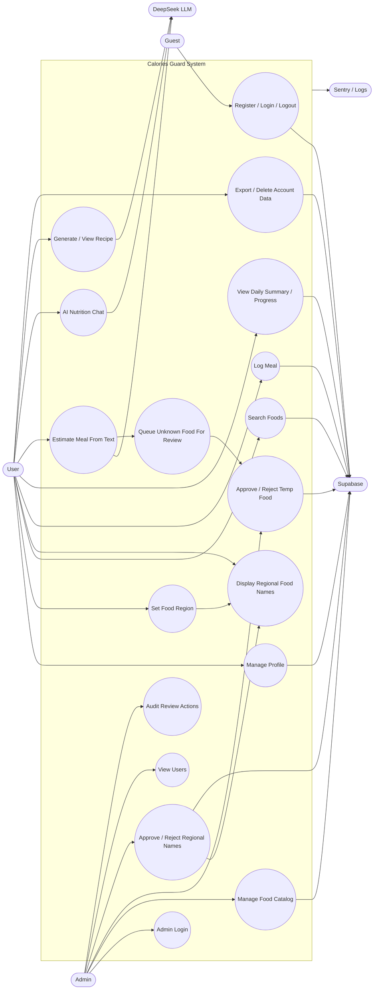

# Calories Guard — Use Case Diagram

> Diagram style: Mermaid flowchart approximation of a UML use case diagram.

## Actors

| Actor | Description |
|---|---|
| Guest | ผู้ใช้ที่ยังไม่ login |
| User | ผู้ใช้ทั่วไปที่บันทึกอาหารและใช้ AI |
| Admin | ผู้ดูแลระบบ ตรวจเมนูและชื่อท้องถิ่น |
| DeepSeek | AI provider สำหรับ chat, meal estimate, recipe generation |
| Supabase | Auth, Postgres, Storage |
| Monitoring | Sentry/logging/alerts |

## High-Level Use Case Diagram

## User App Use Cases

| ID | Use Case | Primary Actor | Main Data |
|---|---|---|---|
| UC-U01 | Register account | Guest | `users`, Supabase Auth |
| UC-U02 | Login / logout | Guest/User | JWT/session |
| UC-U03 | Update profile and goals | User | `users`, target calories/macros |
| UC-U04 | Set regional food preference | User | `users.region`, `users.region_source` |
| UC-U05 | Search canonical food | User | `foods` |
| UC-U06 | Search regional alias | User | `food_regional_names` |
| UC-U07 | View regional display names | User | `display_name`, `regional_name` |
| UC-U08 | Log meal manually | User | `meals`, `detail_items`, `daily_summaries` |
| UC-U09 | Estimate meal with AI | User | DeepSeek, `foods`, `temp_food` |
| UC-U10 | Submit unknown food | User | `temp_food`, `verified_food` |
| UC-U11 | Submit regional food name | User | `food_regional_name_submissions` |
| UC-U12 | View recipe | User | `recipes`, DeepSeek on first generation |
| UC-U13 | Chat with nutrition coach | User | DeepSeek, user context |
| UC-U14 | Export own data | User | PDPA export JSON |
| UC-U15 | Soft delete account | User | `users.deleted_at` |

## Admin Web Use Cases

| ID | Use Case | Primary Actor | Main Data |
|---|---|---|---|
| UC-A01 | Login as admin | Admin | JWT with `role_id=1` |
| UC-A02 | View dashboard | Admin | foods, temp food, regional submissions |
| UC-A03 | Manage food catalog | Admin | `foods`, `dishes`, `units` |
| UC-A04 | Review temp food | Admin | `temp_food`, `verified_food` |
| UC-A05 | Approve temp food | Admin | promote to `foods` |
| UC-A06 | Reject temp food | Admin | remove pending request |
| UC-A07 | Review regional names | Admin | `food_regional_name_submissions` |
| UC-A08 | Approve regional name | Admin | `food_regional_names`, `food_regional_popularity` |
| UC-A09 | Reject regional name | Admin | submission status |
| UC-A10 | View users | Admin | `users` |

## AI Use Cases

| ID | Use Case | Trigger | Expected Result |
|---|---|---|---|
| UC-AI01 | Extract foods from free Thai text | `/api/meals/estimate` | Known foods returned from DB |
| UC-AI02 | Match regional aliases | User types local name | Canonical food found |
| UC-AI03 | Estimate unknown food | No DB/dictionary match | DeepSeek estimates macros |
| UC-AI04 | Queue unknown food | AI estimate succeeds | Row appears in `temp_food` |
| UC-AI05 | Generate recipe | Missing recipe row | DeepSeek creates recipe and backend caches it |
| UC-AI06 | Nutrition coach answer | Chat in scope | Thai nutrition answer |
| UC-AI07 | Out-of-scope refusal | Chat off-topic | Polite refusal |
| UC-AI08 | Provider outage handling | DeepSeek error/timeout | 502/503/504 path, no crash |
